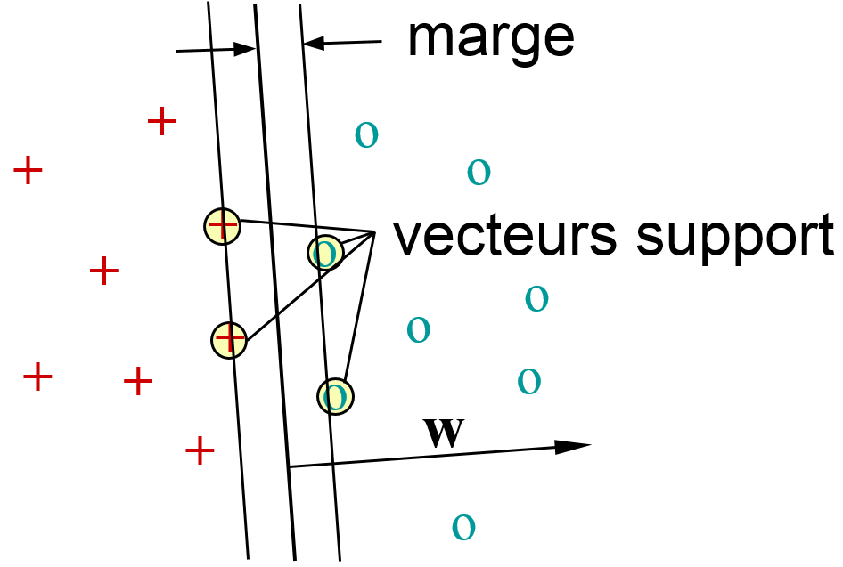
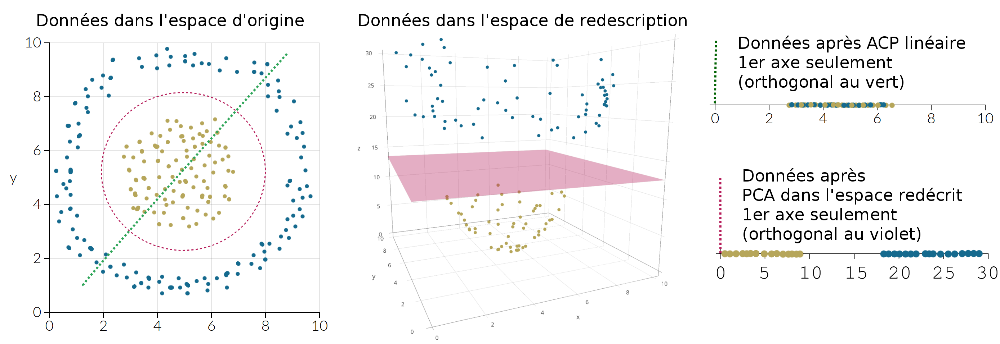

```{r message = FALSE}
set.seed(16)
#{data-background="neurone.png"}
library("neuralnet")
library("mclust")
library("caret")
library("ROCR")
library("knitr")
library("GGally")

knitr::opts_chunk$set(
  fig.width = 7, fig.height = 6,
  fig.align = "center", 
  size = "tiny", 
  echo = FALSE, 
  eval = TRUE, 
  warning = FALSE, 
  message = FALSE, 
  results = TRUE, 
  comment = "")
```

```{r}
# Les fonctions utilisées

# La fonction accuracy (taux de bien prédit)
acc = function (resultats) {
  return(sum(diag(resultats)) / sum(resultats))
}

# La fonction sensibilité (taux sur les positifs bien prédit)
sens = function (resultats) {
  if (nrow(resultats) >= 2) {
    return(resultats[2,2] / (resultats[2,2] + resultats[1,2]))
  } else {
    return(NA)
  }
}

# La fonction spécifité (taux sur les négatifs bien prédit)
spec = function (resultats) {
  if (nrow(resultats) >= 2) {
    return(resultats[1,1] /(resultats[2,1] + resultats[1,1]))
  } else {
    return(NA)
  }
}

# La fonction F1_Score
scor = function (resultats) {
  return((2 * resultats[2,2]) / (2 * resultats[2,2] + resultats[1,2] + resultats[2,1]))
}

# La fonction de prédiction
fonction_prediction =  function(neurone, data) {
  reseau = neuralnet(formule, data = data, hidden = c(neurone))
  predire = compute(reseau, data[,1:207], rep = 1)
  prediction = ifelse(predire$net.result >= 0.5, 1 ,0)
  
  return(prediction)
}

fonction_predire =  function(neurone, data) {
  reseau = neuralnet(formule, data = data, hidden = c(neurone))
  predire = compute(reseau, data[,1:207], rep = 1)
  return(predire)
}

# Les fonction COURBE ROC
roc_courbe.sens = function (predire.ech, clairance.ech) {
  v = rep(NA, 100)
  for (i in 1:100) {
    clairance.pred <- predire.ech >= seuil[i]
    v[i] <- sens(table(clairance.pred, clairance.ech))
  }
  return(v)
}

roc_courbe.spe = function (predire.ech, clairance.ech) {
  v = rep(NA, 100)
  for (i in 1:100) {
    clairance.pred <- predire.ech >= seuil[i]
    v[i] <- spec(table(clairance.pred, clairance.ech))
  }
  return(v)
}

# Les fonctions inutilisées (ici)
prediction2 = function (reseau) {
  realite2 = as.numeric(reseau$response)
  prediction2 = reseau$net.result
  results <- data.frame(actual = realite2, prediction = prediction2)
  names(results) <- c("Realité", "Prédiction")
  return(results)
}
perfection2 = function(matrice) {
  acc.app <- acc(matrice)
  err.app <- err(matrice)
  perf.app <- c(acc.app, err.app)
  names(perf.app) <- c("accuracy", "erreur")
  return(perf.app)
}
```

```{r}
setwd("../Marc")
placenta1 = na.omit(read.table(".././data/placenta90.208.Rdata.txt", dec = ".", sep = "\t", header =TRUE))

prelevage = read.csv(".././data/placenta_MOE_2D_192.csv", dec = ".", sep = ";", header =TRUE)
ok = read.csv(".././data/placenta_edragon_91mol.csv", dec = ".", sep = ";", header =TRUE)
moe.avec = data.frame(prelevage$Noms, prelevage$CI)
moe.sans = moe.avec[-which(moe.avec[,"prelevage.CI"] >= 1.57),]
Noms = moe.sans[, "prelevage.Noms"]
placenta.nom = data.frame(Noms, placenta1)
```

## Déroulement du stage

  - Apprentissage de R avancé

  - Apprentissage de la méthode de prédiction choisie et de sa librairie R
```{r, out.width = "340px"}
knitr::include_graphics("couche_neurone.jpeg")
```

  - Apprentissage des critères de validation d'un modèle d'apprentissage en classification
  
  - Application aux données "barrières placentaires"

## Objectif du stage

Problématique :  

**Établir un modèle permettant de prédire si une molécule donnée traverse la barrière placentaire.**

```{r, out.width = "340px"}
knitr::include_graphics("placenta.png")
```

  - Méthode utilisée : utilisation d'un réseau de neurone et SVM

# Les données

## Jeu de données

Le jeu de données comporte :  

  - 91 molécules décrites par  
  - 800 descripteurs calculées avec le logiciel e-dragon  
  - une mesure de clairance, CI  

```{r}
kable(head(placenta.nom[,c(1,2,6:8)]))
```

## Nettoyage des données

```{r fig.width = 10, fig.height = 6}
par(mfrow = c(1,2))
boxplot(moe.avec[,"prelevage.CI"], main = "Boxplot de la clairance avec la valeur aberrante")
boxplot(moe.sans[,"prelevage.CI"], main = "Boxplot de la clairance sans la valeur aberrante")
```

## Transformation de la variable "clairance" (CI)

```{r}
CI_groupe = as.factor(ifelse(placenta1$CI <= 0.5, "CI_groupeCI", "grandCI"))
hist(placenta1[,"CI"], main = "Histogramme de la clairance", col = c(3,3,3,3,3,2,2,2,2,2,2))
legend(x = "topleft", legend = levels(CI_groupe), col = c(2,3), pch = 21, cex = 1)
```

## Visualisation des données

Données non normalisés
```{r fig.width = 10, fig.height = 6}
par(mfrow = c(1,2))
placenta1 = scale(placenta1, center = TRUE, scale = FALSE)
placenta1.acp <- prcomp(as.matrix(placenta1[,2:nrow(placenta1)]))
biplot(placenta1.acp, main = "Biplot du jeu de données")
boxplot(placenta1[,c(2, 75:90)], main = "Boxplot du jeu de données", las = 2)
```

<span style='font-size:12px; border:1px'> Source : https://journals.openedition.org/cal/7364 </span> 

##

Données après normalisation
```{r fig.width = 10, fig.height = 6}
placenta1 = scale(placenta1, center = TRUE, scale = TRUE)
placenta1.acp <- prcomp(as.matrix(placenta1[,2:nrow(placenta1)]))
biplot(placenta1.acp, main = "Biplot du jeu de données")
```

# Les réseaux de neurones

## Théorie

<span style='font-size:30px; border:1px'> Source : "Les réseaux de neurones peuvent s'utiliser pour extraire des modèles et détecter des tendances reposant sur des fonctions mathématiques compliquées trop difficiles, voire impossible, à modéliser à l'aide de techniques analytiques ou paramétriques traditionnelles." </span>

<span style='font-size:15px; border:1px'> 
Source : http://www.statsoft.fr/concepts-statistiques/reseaux-de-neurones-automatises  
</span>

```{r, out.width = "500px"}
knitr::include_graphics("nn1.png")
```
<span style='font-size:25px; border:1px'> Figure 1 : Un neurone </span>  

## 

```{r, out.width = "750px"}
knitr::include_graphics("nn2.png")
```
</span> <span style='font-size:25px; border:1px'> Figure 2 : Un réseau de neurone </span>  

</span> <span style='font-size:20px; border:1px'>
Images issues du cours de Frédéric Guyon - Méthodes d'apprentissage avec R 
</span>

## Le package 'neuralnet'


## Échantillon d'apprentissage versus Échantillon de validation

<span style='font-size:20px; border:1px'>
L'échantillon d'apprentissage est constitué aléatoirement de 2/3 des individus du jeu de données.  
L'échantillon de validation est constitué aléatoirement de 1/3 des individus du jeu de données.  
</span>

<span style='font-size:20px; border:1px'>
L'échantillon de validation permet de valider les résultats obtenus dans l'échantillon d'apprentissage.  
</span>

<span style='font-size:20px; border:1px'>
Le meilleur modèle :
</span>

<span style='font-size:20px; border:1px'>
  - très bon accuracy dans les deux échantillons  
  - le plus simple possible
</span>

## Table de confusion et critères calculés

Tableau de confusion : 
```{r}
Observé.Prédiction = c("0", "1")
Val1 = c("TN", "FN")
Val2 = c("FP", "TP")
data.tableau = data.frame(Observé.Prédiction, Val1, Val2)
names(data.tableau) <- c("Observé-Prédiction", "0", "1")
kable(data.tableau)
```

Les critères : 

  - Accuracy = (TN + TP) / (TN + FN + FP + TP)  
  - Sensibilité = TP / (TP + FN)  
  - Spécificité = TN / (TN + FP)  
  - F1-score = 2 x (Sensibilite x Spécificité) / (Sensibilité + Spécificité)  

## Courbe ROC


<span style='font-size:25px; border:1px'> Figure : Exemple de courbe ROC </span>

<span style='font-size:35px; border:1px'>
La courbe ROC (Receiving Operator Characteristics) permet de définir quelle est cette valeur seuil en représentant la sensibilité (Se) en ordonnée et 1 moins la spécificité (1-Sp) en abscisse.
</span>

<span style='font-size:20px; border:1px'> http://www.adscience.fr/uploads/ckfiles/files/html_files/StatEL/statel_courbe_ROC.htm </span>


# Applications aux données

## Plusieurs essais réalisés 

Les différents essais : 
```{r}
Couche = c("1 couche", "1 couche", "2 couche", "2 couche")
couche1 = c(" 1 (perceptron) ", " n ", " 2n ", " n ")
couche2 = c(" - ", " - ", " n ", " 2n ")
case3 = c("TN", "FN")
case4 = c("TN", "FN")
data.tableau = data.frame(Couche, couche1, couche2)
names(data.tableau) <- c("Couche(s)", "1e couche", "2e couche")
kable(data.tableau)
```

# Prédiction

```{r}
placenta2 = as.data.frame(placenta1)
CI_groupe = as.numeric(as.factor(ifelse(placenta2$CI <= 0, "CI_groupeCI", "grandCI"))== "CI_groupeCI") # 1 = CI_groupeCI
data.placenta = data.frame(placenta1[,c(2:ncol(placenta1))], CI_groupe)
ind.app <- sample(1:nrow(data.placenta), 60)
placenta.app <- data.placenta[ind.app,]
placenta.val <- data.placenta[-ind.app,]

formule <- paste(colnames(data.placenta[,- c(ncol(data.placenta))]),collapse=" + ")  
formule = as.formula(CI_groupe ~ ast_fraglike + ast_fraglike_ext + ast_violation + a_don + a_ICM + BCUT_SLOGP_1 + BCUT_SLOGP_3 + BCUT_SMR_0 + b_1rotN + b_double + chiral_u + density + FCharge + GCUT_PEOE_1 + GCUT_PEOE_2 + GCUT_SLOGP_1 + GCUT_SLOGP_2 + GCUT_SMR_1 + lip_violation + logP.o.w. + opr_leadlike + PEOE_PC. + PEOE_PC..1 + PEOE_RPC. + PEOE_RPC..1 + PEOE_VSA.1 + PEOE_VSA.2 + PEOE_VSA.3 + PEOE_VSA.4 + PEOE_VSA.1.1 + PEOE_VSA.2.1 + PEOE_VSA.3.1 + PEOE_VSA.4.1 + PEOE_VSA.5.1 + PEOE_VSA.6.1 + PEOE_VSA_FHYD + PEOE_VSA_FPNEG + PEOE_VSA_FPPOS + PEOE_VSA_NEG + PEOE_VSA_PNEG + PEOE_VSA_POL + PEOE_VSA_PPOS + reactive + SlogP_VSA0 + SlogP_VSA1 + SlogP_VSA2 + SlogP_VSA3 + SlogP_VSA4 + SlogP_VSA6 + SMR_VSA1 + SMR_VSA2 + SMR_VSA3 + SMR_VSA4 + vsa_acc + vsa_base + vsa_don + vsa_other + vsa_pol + Ms + ARR + nCIR + nAB + nH + nN + nO + nR05 + nR07 + nR08 + TI2 + J + Jhetp + MAXDN + MAXDP + S3K + PW2 + D.Dr05 + D.Dr06 + D.Dr08 + D.Dr09 + D.Dr10 + T.Cl..Cl. + SRW05 + MPC10 + PCR + X0Av + X1Av + ATS7m + MATS3m + MATS4m + MATS5m + MATS1v + MATS2v + MATS3v + MATS8v + MATS3p + MATS4p + GATS1m + GATS2m + GATS3m + GATS8m + GATS3v + GATS8v + GATS3e + GATS5e + GATS7e + GATS8e + GATS1p + GATS3p + JGI1 + JGI3 + JGI5 + JGI7 + JGI8 + JGI9 + JGI10 + JGT + DP20 + J3D + PJI3 + L.Bw + AROM + DISPm + DISPv + DISPe + G.N..N. + G.N..O. + G.N..S. + G.N..Cl. + G.O..O. + G.S..S. + nCs + nCrs + nCrt + nCbH + nCb. + nCconj + nArCOOR + nRCONH2 + nRCONHR + nRCONR2 + nROCON + nArCO + nC..N.N2 + nArNH2 + nArNHR + nRNR2 + nArOH + nOHp + nOHs + nOHt + nRSR + nArX + nBeta.Lactams + nOxolanes + nThiazoles + nHBonds + C.003 + C.007 + C.008 + C.009 + C.011 + C.016 + C.017 + C.018 + C.019 + C.025 + C.028 + C.031 + C.032 + C.033 + C.037 + C.040 + C.041 + C.043 + C.044 + H.048 + H.049 + H.053 + O.056 + O.059 + N.066 + N.067 + N.068 + N.072 + N.074 + Cl.089 + S.107 + S.108 + S.110 + Hy + MLOGP + ALOGP + LAI + GVWAI.50 + Inflammat.80 + Inflammat.50 + Depressant.80 + Psychotic.80 + Hypertens.80 + Hypertens.50 + Hypnotic.80 + Hypnotic.50 + Neoplastic.80 + Neoplastic.50 + Infective.50 + ALOGPS_logP + ALOGPS_logS)

Paramètres = c("Taux de bien prédit","Sensibilité", "Specifité", "F1_Score")
predire2.app = fonction_predire(2, placenta.app)
predire2.val = fonction_predire(2, placenta.val)
prediction2.app = ifelse(predire2.app$net.result >= 0.5, 1 ,0)
prediction2.val = ifelse(predire2.val$net.result >= 0.5, 1 ,0)
confiance.2.app <- table(prediction2.app, placenta.app$CI_groupe, dnn = c("predit", "observe"))
confiance.2.val <- table(prediction2.val, placenta.val$CI_groupe, dnn = c("predit", "observe"))
```

## Prédiction dans l'échantillon d'apprentissage et de validation pour 1 couche avec 2 neurones

<span style='font-size:20px; border:1px'> Prédiction pour l'échantillon d'apprentissage </span>
```{r}
knitr::kable(confiance.2.app)
```

<span style='font-size:20px; border:1px'> Prédiction pour l'échantillon de validation </span>
```{r}
knitr::kable(confiance.2.val)
```

## Les Critères
```{r fig.width = 6, fig.height = 4}
Valeurs.2.app = c(acc(confiance.2.app), sens(confiance.2.app), spec(confiance.2.app), scor(confiance.2.app))
Valeurs.2.val = c(acc(confiance.2.val), sens(confiance.2.val), spec(confiance.2.val), scor(confiance.2.val))
tableau2 = data.frame(Paramètres, Valeurs.2.app, Valeurs.2.val)
names(tableau2) = c("Paramètres", "Apprentissage", "Validation")
kable(tableau2)

specificite <- seq(0.01, 1, 0.01)
seuil <- seq(0, 1, length.out = 100)
clairance.app <- placenta.app$CI_groupe
clairance.val <- placenta.val$CI_groupe

vsens.app2 = roc_courbe.sens(predire.ech = predire2.app$net.result, clairance.ech = clairance.app)
vsens.val2 = roc_courbe.sens(predire.ech = predire2.val$net.result, clairance.ech = clairance.val)
sensibilité <- data.frame(vsens.app2, vsens.val2)
matplot(1-specificite,sensibilité,col=rainbow(2),type="l",lty=1, main = "1 couche 2 neurones")
```

## Prédiction : 1 couche avec n neurones (Courbe ROC)
```{r}
# Prédiction pour 1 couche = 1 neurone
predire1.app = fonction_predire(1, placenta.app)
predire1.val = fonction_predire(1, placenta.val)
prediction1.app = ifelse(predire1.app$net.result >= 0.5, 1 ,0)
prediction1.val = ifelse(predire1.val$net.result >= 0.5, 1 ,0)
confiance.1.app <- table(prediction1.app, placenta.app$CI_groupe, dnn = c("predit", "observe"))
confiance.1.val <- table(prediction1.val, placenta.val$CI_groupe, dnn = c("predit", "observe"))

# Prediction pour 1 couche = 3 neurones
predire3.app = fonction_predire(3, placenta.app)
predire3.val = fonction_predire(3, placenta.val)
prediction.3.app = ifelse(predire3.app$net.result >= 0.5, 1 ,0)
prediction.3.val = ifelse(predire3.val$net.result >= 0.5, 1 ,0)
confiance.3.app <- table(prediction.3.app, placenta.app$CI_groupe, dnn = c("predit", "observe"))
confiance.3.val <- table(prediction.3.val, placenta.val$CI_groupe, dnn = c("predit", "observe"))

# Prédiction pour 1 couche = 4 neurones
predire4.app = fonction_predire(4, placenta.app)
predire4.val = fonction_predire(4, placenta.val)
prediction.4.app = ifelse(predire4.app$net.result >= 0.5, 1 ,0)
prediction.4.val = ifelse(predire4.val$net.result >= 0.5, 1 ,0)
confiance.4.app <- table(prediction.4.app, placenta.app$CI_groupe, dnn = c("predit", "observe"))
confiance.4.val <- table(prediction.4.val, placenta.val$CI_groupe, dnn = c("predit", "observe"))

# Prédiction pour 1 couche = 5 neurones
predire5.app = fonction_predire(5, placenta.app)
predire5.val = fonction_predire(5, placenta.val)
prediction.5.app = ifelse(predire5.app$net.result >= 0.5, 1 ,0)
prediction.5.val = ifelse(predire5.val$net.result >= 0.5, 1 ,0)
confiance.5.app <- table(prediction.5.app, placenta.app$CI_groupe, dnn = c("predit", "observe"))
confiance.5.val <- table(prediction.5.val, placenta.val$CI_groupe, dnn = c("predit", "observe"))

# Prédiction pour 1 couche = 6 neurones
predire6.app = fonction_predire(6, placenta.app)
predire6.val = fonction_predire(6, placenta.val)
prediction.6.app = ifelse(predire6.app$net.result >= 0.5, 1 ,0)
prediction.6.val = ifelse(predire6.val$net.result >= 0.5, 1 ,0)
confiance.6.app <- table(prediction.6.app, placenta.app$CI_groupe, dnn = c("predit", "observe"))
confiance.6.val <- table(prediction.6.val, placenta.val$CI_groupe, dnn = c("predit", "observe"))

# Prédiction pour 1 couche = 7 neurones
predire7.app = fonction_predire(7, placenta.app)
predire7.val = fonction_predire(7, placenta.val)
prediction.7.app = ifelse(predire7.app$net.result >= 0.5, 1 ,0)
prediction.7.val = ifelse(predire7.val$net.result >= 0.5, 1 ,0)
confiance.7.app <- table(prediction.7.app, placenta.app$CI_groupe, dnn = c("predit", "observe"))
confiance.7.val <- table(prediction.7.val, placenta.val$CI_groupe, dnn = c("predit", "observe"))

# Prédiction pour 1 couche = 8 neurones
predire8.app = fonction_predire(8, placenta.app)
predire8.val = fonction_predire(8, placenta.val)
prediction.8.app = ifelse(predire8.app$net.result >= 0.5, 1 ,0)
prediction.8.val = ifelse(predire8.val$net.result >= 0.5, 1 ,0)
confiance.8.app <- table(prediction.8.app, placenta.app$CI_groupe, dnn = c("predit", "observe"))
confiance.8.val <- table(prediction.8.val, placenta.val$CI_groupe, dnn = c("predit", "observe"))

```

```{r, eval = FALSE}
# Prédiction pour 1 couche = 9 neurones
predire9.app = fonction_predire(9, placenta.app)
predire9.val = fonction_predire(9, placenta.val)
prediction.9.app = ifelse(predire9.app$net.result >= 0.5, 1 ,0)
prediction.9.val = ifelse(predire9.val$net.result >= 0.5, 1 ,0)
confiance.9.app <- table(prediction.9.app, placenta.app$CI_groupe, dnn = c("predit", "observe"))
confiance.9.val <- table(prediction.9.val, placenta.val$CI_groupe, dnn = c("predit", "observe"))

# Prédiction pour 1 couche = 10 neurones
predire10.app = fonction_predire(10, placenta.app)
predire10.val = fonction_predire(10, placenta.val)
prediction.10.app = ifelse(predire10.app$net.result >= 0.5, 1 ,0)
prediction.10.val = ifelse(predire10.val$net.result >= 0.5, 1 ,0)
confiance.10.app <- table(prediction.10.app, placenta.app$CI_groupe, dnn = c("predit", "observe"))
confiance.10.val <- table(prediction.10.val, placenta.val$CI_groupe, dnn = c("predit", "observe"))

# Prédiction pour 1 couche = 20 neurones
predire20.app = fonction_predire(20, placenta.app)
predire20.val = fonction_predire(20, placenta.val)
prediction.20.app = ifelse(predire20.app$net.result >= 0.5, 1 ,0)
prediction.20.val = ifelse(predire20.val$net.result >= 0.5, 1 ,0)
confiance.20.app <- table(prediction.20.app, placenta.app$CI_groupe, dnn = c("predit", "observe"))
confiance.20.val <- table(prediction.20.val, placenta.val$CI_groupe, dnn = c("predit", "observe"))

# Prédiction pour 1 couche = 30 neurones
predire30.app = fonction_predire(30, placenta.app)
predire30.val = fonction_predire(30, placenta.val)
prediction.30.app = ifelse(predire30.app$net.result >= 0.5, 1 ,0)
prediction.30.val = ifelse(predire30.val$net.result >= 0.5, 1 ,0)
confiance.30.app <- table(prediction.30.app, placenta.app$CI_groupe, dnn = c("predit", "observe"))
confiance.30.val <- table(prediction.30.val, placenta.val$CI_groupe, dnn = c("predit", "observe"))

# Prédiction pour 1 couche = 40 neurones
predire40.app = fonction_predire(40, placenta.app)
predire40.val = fonction_predire(40, placenta.val)
prediction.40.app = ifelse(predire40.app$net.result >= 0.5, 1 ,0)
prediction.40.val = ifelse(predire40.val$net.result >= 0.5, 1 ,0)
confiance.40.app <- table(prediction.40.app, placenta.app$CI_groupe, dnn = c("predit", "observe"))
confiance.40.val <- table(prediction.40.val, placenta.val$CI_groupe, dnn = c("predit", "observe"))

# Prédiction pour 1 couche = 50 neurones
predire50.app = fonction_predire(50, placenta.app)
predire50.val = fonction_predire(50, placenta.val)
prediction.50.app = ifelse(predire50.app$net.result >= 0.5, 1 ,0)
prediction.50.val = ifelse(predire50.val$net.result >= 0.5, 1 ,0)
confiance.50.app <- table(prediction.50.app, placenta.app$CI_groupe, dnn = c("predit", "observe"))
confiance.50.val <- table(prediction.50.val, placenta.val$CI_groupe, dnn = c("predit", "observe"))

# Prédiction pour 1 couche = 100 neurones
predire100.app = fonction_predire(100, placenta.app)
predire100.val = fonction_predire(100, placenta.val)
prediction.100.app = ifelse(predire100.app$net.result >= 0.5, 1 ,0)
prediction.100.val = ifelse(predire100.val$net.result >= 0.5, 1 ,0)
confiance.100.app <- table(prediction.100.app, placenta.app$CI_groupe, dnn = c("predit", "observe"))
confiance.100.val <- table(prediction.100.val, placenta.val$CI_groupe, dnn = c("predit", "observe"))

# Prédiction pour 1 couche = 150 neurones
predire150.app = fonction_predire(150, placenta.app)
predire150.val = fonction_predire(150, placenta.val)
prediction.150.app = ifelse(predire150.app$net.result >= 0.5, 1 ,0)
prediction.150.val = ifelse(predire150.val$net.result >= 0.5, 1 ,0)
confiance.150.app <- table(prediction.150.app, placenta.app$CI_groupe, dnn = c("predit", "observe"))
confiance.150.val <- table(prediction.150.val, placenta.val$CI_groupe, dnn = c("predit", "observe"))

# Prédiction pour 1 couche = 207 neurones
predire207.app = fonction_predire(207, placenta.app)
predire207.val = fonction_predire(207, placenta.val)
prediction.207.app = ifelse(predire207.app$net.result >= 0.5, 1 ,0)
prediction.207.val = ifelse(predire207.val$net.result >= 0.5, 1 ,0)
confiance.207.app <- table(prediction.207.app, placenta.app$CI_groupe, dnn = c("predit", "observe"))
confiance.207.val <- table(prediction.207.val, placenta.val$CI_groupe, dnn = c("predit", "observe"))

couches.neurones = c("1 couche 1 neurone", "1 couche 2 neurones", "1 couche 3 neurones", "1 couche 4 neurones", "1 couche 5 neurones", "1 couche 6 neurones", "1 couche 7 neurones", "1 couche 8 neurones", "1 couche 9 neurones", "1 couche 10 neurones", "1 couche 20 neurones", "1 couche 30 neurones", "1 couche 40 neurones")
apprentissage = c(acc(confiance.1.app), acc(confiance.2.app), acc(confiance.3.app), acc(confiance.4.app), acc(confiance.5.app), acc(confiance.6.app), acc(confiance.7.app), acc(confiance.8.app), acc(confiance.9.app), acc(confiance.10.app), acc(confiance.20.app), acc(confiance.30.app), acc(confiance.40.app))
validation = c(acc(confiance.1.val), acc(confiance.2.val), acc(confiance.3.val), acc(confiance.4.val), acc(confiance.5.val), acc(confiance.6.val), acc(confiance.7.val), acc(confiance.8.val), acc(confiance.9.val), acc(confiance.10.val), acc(confiance.20.val), acc(confiance.30.val), acc(confiance.30.val))
kable(data.frame(couches.neurones, apprentissage, validation))
```

```{r fig.width = 10, fig.height = 7}
specificite <- seq(0.01, 1, 0.01)
seuil <- seq(0, 1, length.out = 100)
clairance.app <- placenta.app$CI_groupe
clairance.val <- placenta.val$CI_groupe

par(mfrow = c(2,3))
#vsens.app1 = roc_courbe.sens(predire.ech = predire1.app$net.result, clairance.ech = clairance.app)
#vsens.val1 = roc_courbe.sens(predire.ech = predire1.val$net.result, clairance.ech = clairance.val)
#sensibilité <- data.frame(vsens.app1, vsens.val1)
#matplot(1-specificite,sensibilité,col=rainbow(2),type="l",lty=1, main = "1 couche 1 neurone")

# rouge = app et bleu = val

vsens.app3 = roc_courbe.sens(predire.ech = predire3.app$net.result, clairance.ech = clairance.app)
vsens.val3 = roc_courbe.sens(predire.ech = predire3.val$net.result, clairance.ech = clairance.val)
sensibilité <- data.frame(vsens.app3, vsens.val3)
matplot(1-specificite,sensibilité,col=rainbow(2),type="l",lty=1,  main = "1 couche 3 neurones")
#####

vsens.app4 = roc_courbe.sens(predire.ech = predire4.app$net.result, clairance.ech = clairance.app)
vsens.val4 = roc_courbe.sens(predire.ech = predire4.val$net.result, clairance.ech = clairance.val)
sensibilité <- data.frame(vsens.app4, vsens.val4)
matplot(1-specificite,sensibilité,col=rainbow(2),type="l",lty=1,  main = "1 couche 4 neurones")
#####

vsens.app5 = roc_courbe.sens(predire.ech = predire5.app$net.result, clairance.ech = clairance.app)
vsens.val5 = roc_courbe.sens(predire.ech = predire5.val$net.result, clairance.ech = clairance.val)
sensibilité <- data.frame(vsens.app5, vsens.val5)
matplot(1-specificite,sensibilité,col=rainbow(2),type="l",lty=1,  main = "1 couche 5 neurones")
#####

vsens.app6 = roc_courbe.sens(predire.ech = predire6.app$net.result, clairance.ech = clairance.app)
vsens.val6 = roc_courbe.sens(predire.ech = predire6.val$net.result, clairance.ech = clairance.val)
sensibilité <- data.frame(vsens.app6, vsens.val6)
matplot(1-specificite,sensibilité,col=rainbow(2),type="l",lty=1,  main = "1 couche 6 neurones")
#####

vsens.app7 = roc_courbe.sens(predire.ech = predire7.app$net.result, clairance.ech = clairance.app)
vsens.val7 = roc_courbe.sens(predire.ech = predire7.val$net.result, clairance.ech = clairance.val)
sensibilité <- data.frame(vsens.app7, vsens.val7)
matplot(1-specificite,sensibilité,col=rainbow(2),type="l",lty=1,  main = "1 couche 7 neurones")
#####

vsens.app8 = roc_courbe.sens(predire.ech = predire8.app$net.result, clairance.ech = clairance.app)
vsens.val8 = roc_courbe.sens(predire.ech = predire8.val$net.result, clairance.ech = clairance.val)
sensibilité <- data.frame(vsens.app8, vsens.val8)
matplot(1-specificite,sensibilité,col=rainbow(2),type="l",lty=1,  main = "1 couche 8 neurones")
```

```{r fig.width = 10, fig.height = 7, eval = FALSE}
## Courbe ROC (2)
par(mfrow = c(2,3))

vsens.app9 = roc_courbe.sens(predire.ech = predire9.app$net.result, clairance.ech = clairance.app)
vsens.val9 = roc_courbe.sens(predire.ech = predire9.val$net.result, clairance.ech = clairance.val)
sensibilité <- data.frame(vsens.app9, vsens.val9)
matplot(1-specificite,sensibilité,col=rainbow(2),type="l",lty=1,  main = "1 couche 9 neurones")
#####

vsens.app10 = roc_courbe.sens(predire.ech = predire10.app$net.result, clairance.ech = clairance.app)
vsens.val10 = roc_courbe.sens(predire.ech = predire10.val$net.result, clairance.ech = clairance.val)
sensibilité <- data.frame(vsens.app10, vsens.val10)
matplot(1-specificite,sensibilité,col=rainbow(2),type="l",lty=1,  main = "1 couche 10 neurones")
#####

vsens.app20 = roc_courbe.sens(predire.ech = predire20.app$net.result, clairance.ech = clairance.app)
vsens.val20 = roc_courbe.sens(predire.ech = predire20.val$net.result, clairance.ech = clairance.val)
sensibilité <- data.frame(vsens.app20, vsens.val20)
matplot(1-specificite,sensibilité,col=rainbow(2),type="l",lty=1,  main = "1 couche 20 neurones")
#####

vsens.app30 = roc_courbe.sens(predire.ech = predire30.app$net.result, clairance.ech = clairance.app)
vsens.val30 = roc_courbe.sens(predire.ech = predire30.val$net.result, clairance.ech = clairance.val)
sensibilité <- data.frame(vsens.app30, vsens.val30)
matplot(1-specificite,sensibilité,col=rainbow(2),type="l",lty=1,  main = "1 couche 30 neurones")
#####

vsens.app40 = roc_courbe.sens(predire.ech = predire40.app$net.result, clairance.ech = clairance.app)
vsens.val40 = roc_courbe.sens(predire.ech = predire40.val$net.result, clairance.ech = clairance.val)
sensibilité <- data.frame(vsens.app40, vsens.val40)
matplot(1-specificite,sensibilité,col=rainbow(2),type="l",lty=1,  main = "1 couche 40 neurones")
```

## Prédiction : 2 couches avec 2n/n de neurones (Courbe ROC)
```{r}
# Prédiction pour 2 couches = 2.1 neurones
predire2.1.app = fonction_predire(c(2,1), placenta.app)
predire2.1.val = fonction_predire(c(2,1), placenta.val)
prediction.2.1.app = ifelse(predire2.1.app$net.result >= 0.5, 1 ,0)
prediction.2.1.val = ifelse(predire2.1.val$net.result >= 0.5, 1 ,0)
confiance.2.1.app <- table(prediction.2.1.app, placenta.app$CI_groupe, dnn = c("predit", "observe"))
confiance.2.1.val <- table(prediction.2.1.val, placenta.val$CI_groupe, dnn = c("predit", "observe"))

# Prédiction pour 2 couches = 4.2 neurones
predire4.2.app = fonction_predire(c(4,2), placenta.app)
predire4.2.val = fonction_predire(c(4,2), placenta.val)
prediction.4.2.app = ifelse(predire4.2.app$net.result >= 0.5, 1 ,0)
prediction.4.2.val = ifelse(predire4.2.val$net.result >= 0.5, 1 ,0)
confiance.4.2.app <- table(prediction.4.2.app, placenta.app$CI_groupe, dnn = c("predit", "observe"))
confiance.4.2.val <- table(prediction.4.2.val, placenta.val$CI_groupe, dnn = c("predit", "observe"))

# Prédiction pour 2 couches = 6.3 neurones
predire6.3.app = fonction_predire(c(6,3), placenta.app)
predire6.3.val = fonction_predire(c(6,3), placenta.val)
prediction.6.3.app = ifelse(predire6.3.app$net.result >= 0.5, 1 ,0)
prediction.6.3.val = ifelse(predire6.3.val$net.result >= 0.5, 1 ,0)
confiance.6.3.app <- table(prediction.6.3.app, placenta.app$CI_groupe, dnn = c("predit", "observe"))
confiance.6.3.val <- table(prediction.6.3.val, placenta.val$CI_groupe, dnn = c("predit", "observe"))

# Prédiction pour 2 couches = 8.4 neurones
predire8.4.app = fonction_predire(c(8,4), placenta.app)
predire8.4.val = fonction_predire(c(8,4), placenta.val)
prediction.8.4.app = ifelse(predire8.4.app$net.result >= 0.5, 1 ,0)
prediction.8.4.val = ifelse(predire8.4.val$net.result >= 0.5, 1 ,0)
confiance.8.4.app <- table(prediction.8.4.app, placenta.app$CI_groupe, dnn = c("predit", "observe"))
confiance.8.4.val <- table(prediction.8.4.val, placenta.val$CI_groupe, dnn = c("predit", "observe"))

# Prédiction pour 2 couches = 10.5 neurones
predire10.5.app = fonction_predire(c(10,5), placenta.app)
predire10.5.val = fonction_predire(c(10,5), placenta.val)
prediction.10.5.app = ifelse(predire10.5.app$net.result >= 0.5, 1 ,0)
prediction.10.5.val = ifelse(predire10.5.val$net.result >= 0.5, 1 ,0)
confiance.10.5.app <- table(prediction.10.5.app, placenta.app$CI_groupe, dnn = c("predit", "observe"))
confiance.10.5.val <- table(prediction.10.5.val, placenta.val$CI_groupe, dnn = c("predit", "observe"))

# Prédiction pour 2 couches = 20.10 neurones
predire20.10.app = fonction_predire(c(20,10), placenta.app)
predire20.10.val = fonction_predire(c(20,10), placenta.val)
prediction.20.10.app = ifelse(predire20.10.app$net.result >= 0.5, 1 ,0)
prediction.20.10.val = ifelse(predire20.10.val$net.result >= 0.5, 1 ,0)

confiance.20.10.app <- table(prediction.20.10.app, placenta.app$CI_groupe, dnn = c("predit", "observe"))
confiance.20.10.val <- table(prediction.20.10.val, placenta.val$CI_groupe, dnn = c("predit", "observe"))

```

```{r, eval = FALSE}
# Prédiction pour 2 couches = 100.50 neurones
predire100.50.app = fonction_predire(c(100,50), placenta.app)
predire100.50.val = fonction_predire(c(100,50), placenta.val)
prediction.100.50.app = ifelse(predire100.50.app$net.result >= 0.5, 1 ,0)
prediction.100.50.val = ifelse(predire100.50.val$net.result >= 0.5, 1 ,0)
confiance.100.50.app <- table(prediction.100.50.app, placenta.app$CI_groupe, dnn = c("predit", "observe"))
confiance.100.50.val <- table(prediction.100.50.val, placenta.val$CI_groupe, dnn = c("predit", "observe"))

# Prédiction pour 2 couches = 200.100 neurones
predire200.100.app = fonction_predire(c(200,100), placenta.app)
predire200.100.val = fonction_predire(c(200,100), placenta.val)
prediction.200.100.app = ifelse(predire200.100.app$net.result >= 0.5, 1 ,0)
prediction.200.100.val = ifelse(predire200.100.val$net.result >= 0.5, 1 ,0)
confiance.200.100.app <- table(prediction.200.100.app, placenta.app$CI_groupe, dnn = c("predit", "observe"))
confiance.200.100.val <- table(prediction.200.100.val, placenta.val$CI_groupe, dnn = c("predit", "observe"))

couches.neurones = c("2 couches 2 neurones et 1 neurone", "2 couches 4 neurones et 2 neurones", "2 couches 6 neurones et 3 neurones", "2 couches 8 neurones et 4 neurones", "2 couches 10 neurones et 5 neurones", "2 couches 20 neurones et 10 neurones", "2 couches 100 neurones et 50 neurones", "2 couches 200 neurones et 100 neurones")
apprentissage = c(acc(confiance.2.1.app), acc(confiance.4.2.app), acc(confiance.6.3.app), acc(confiance.8.4.app), acc(confiance.10.5.app), acc(confiance.20.10.app), acc(confiance.100.50.app), acc(confiance.200.100.app))
validation = c(acc(confiance.2.1.val), acc(confiance.4.2.val), acc(confiance.6.3.val), acc(confiance.8.4.val), acc(confiance.10.5.val), acc(confiance.20.10.val), acc(confiance.100.50.val), acc(confiance.200.100.val))
kable(data.frame(couches.neurones, apprentissage, validation))
```

```{r  fig.width = 10, fig.height = 7}
par(mfrow = c(2,3))

vsens.app2.1 = roc_courbe.sens(predire.ech = predire2.1.app$net.result, clairance.ech = clairance.app)
vsens.val2.1 = roc_courbe.sens(predire.ech = predire2.1.val$net.result, clairance.ech = clairance.val)
sensibilité <- data.frame(vsens.app2.1, vsens.val2.1)
matplot(1-specificite,sensibilité,col=rainbow(2),type="l",lty=1,  main = "2 couches 2.1 neurones")
#####

vsens.app4.2 = roc_courbe.sens(predire.ech = predire4.2.app$net.result, clairance.ech = clairance.app)
vsens.val4.2 = roc_courbe.sens(predire.ech = predire4.2.val$net.result, clairance.ech = clairance.val)
sensibilité <- data.frame(vsens.app4.2, vsens.val4.2)
matplot(1-specificite,sensibilité,col=rainbow(2),type="l",lty=1,  main = "2 couches 4.2 neurones")
#####

vsens.app6.3 = roc_courbe.sens(predire.ech = predire6.3.app$net.result, clairance.ech = clairance.app)
vsens.val6.3 = roc_courbe.sens(predire.ech = predire6.3.val$net.result, clairance.ech = clairance.val)
sensibilité <- data.frame(vsens.app6.3, vsens.val6.3)
matplot(1-specificite,sensibilité,col=rainbow(2),type="l",lty=1,  main = "2 couches 6.3 neurones")
#####

vsens.app8.4 = roc_courbe.sens(predire.ech = predire8.4.app$net.result, clairance.ech = clairance.app)
vsens.val8.4 = roc_courbe.sens(predire.ech = predire8.4.val$net.result, clairance.ech = clairance.val)
sensibilité <- data.frame(vsens.app8.4, vsens.val8.4)
matplot(1-specificite,sensibilité,col=rainbow(2),type="l",lty=1,  main = "2 couches 8.4 neurones")
#####

vsens.app10.5 = roc_courbe.sens(predire.ech = predire10.5.app$net.result, clairance.ech = clairance.app)
vsens.val10.5 = roc_courbe.sens(predire.ech = predire10.5.val$net.result, clairance.ech = clairance.val)
sensibilité <- data.frame(vsens.app10.5, vsens.val10.5)
matplot(1-specificite,sensibilité,col=rainbow(2),type="l",lty=1,  main = "2 couches 10.5 neurones")
#####

vsens.app20.10 = roc_courbe.sens(predire.ech = predire20.10.app$net.result, clairance.ech = clairance.app)
vsens.val20.10 = roc_courbe.sens(predire.ech = predire20.10.val$net.result, clairance.ech = clairance.val)
sensibilité <- data.frame(vsens.app20.10, vsens.val20.10)
matplot(1-specificite,sensibilité,col=rainbow(2),type="l",lty=1,  main = "2 couches 20.10 neurones")
#####

#vsens.app100.50 = roc_courbe.sens(predire.ech = predire100.50.app$net.result, clairance.ech = clairance.app)
#vsens.val100.50 = roc_courbe.sens(predire.ech = predire100.50.val$net.result, clairance.ech = clairance.val)
#sensibilité <- data.frame(vsens.app100.50, vsens.val100.50)
#matplot(1-specificite,sensibilité,col=rainbow(2),type="l",lty=1,  main = "2 couches 100.50 neurones")
#####

#vsens.app200.100 = roc_courbe.sens(predire.ech = predire200.100.app$net.result, clairance.ech = clairance.app)
#vsens.val200.100 = roc_courbe.sens(predire.ech = predire200.100.val$net.result, clairance.ech = clairance.val)
#sensibilité <- data.frame(vsens.app200.100, vsens.val200.100)
#matplot(1-specificite,sensibilité,col=rainbow(2),type="l",lty=1,  main = "2 couches 200.100 neurones")
```

## Prédiction : 2 couches avec n/2n de neurones (Courbe ROC)
```{r}
# Prédiction pour 2 couches = 1.2 neurones
predire1.2.app = fonction_predire(c(1,2), placenta.app)
predire1.2.val = fonction_predire(c(1,2), placenta.val)
prediction.1.2.app = ifelse(predire1.2.app$net.result >= 0.5, 1 ,0)
prediction.1.2.val = ifelse(predire1.2.val$net.result >= 0.5, 1 ,0)
confiance.1.2.app <- table(prediction.1.2.app, placenta.app$CI_groupe, dnn = c("predit", "observe"))
confiance.1.2.val <- table(prediction.1.2.val, placenta.val$CI_groupe, dnn = c("predit", "observe"))

# Prédiction pour 2 couches = 2.4 neurones
predire2.4.app = fonction_predire(c(2,4), placenta.app)
predire2.4.val = fonction_predire(c(2,4), placenta.val)
prediction.2.4.app = ifelse(predire2.4.app$net.result >= 0.5, 1 ,0)
prediction.2.4.val = ifelse(predire2.4.val$net.result >= 0.5, 1 ,0)
confiance.2.4.app <- table(prediction.2.4.app, placenta.app$CI_groupe, dnn = c("predit", "observe"))
confiance.2.4.val <- table(prediction.2.4.val, placenta.val$CI_groupe, dnn = c("predit", "observe"))

# Prédiction pour 2 couches = 3.6 neurones
predire3.6.app = fonction_predire(c(3,6), placenta.app)
predire3.6.val = fonction_predire(c(3,6), placenta.val)
prediction.3.6.app = ifelse(predire3.6.app$net.result >= 0.5, 1 ,0)
prediction.3.6.val = ifelse(predire3.6.val$net.result >= 0.5, 1 ,0)
confiance.3.6.app <- table(prediction.3.6.app, placenta.app$CI_groupe, dnn = c("predit", "observe"))
confiance.3.6.val <- table(prediction.3.6.val, placenta.val$CI_groupe, dnn = c("predit", "observe"))

# Prédiction pour 2 couches = 4.8 neurones
predire4.8.app = fonction_predire(c(4,8), placenta.app)
predire4.8.val = fonction_predire(c(4,8), placenta.val)
prediction.4.8.app = ifelse(predire4.8.app$net.result >= 0.5, 1 ,0)
prediction.4.8.val = ifelse(predire4.8.val$net.result >= 0.5, 1 ,0)
confiance.4.8.app <- table(prediction.4.8.app, placenta.app$CI_groupe, dnn = c("predit", "observe"))
confiance.4.8.val <- table(prediction.4.8.val, placenta.val$CI_groupe, dnn = c("predit", "observe"))

# Prédiction pour 2 couches = 5.10 neurones
predire5.10.app = fonction_predire(c(5,10), placenta.app)
predire5.10.val = fonction_predire(c(5,10), placenta.val)
prediction.5.10.app = ifelse(predire5.10.app$net.result >= 0.5, 1 ,0)
prediction.5.10.val = ifelse(predire5.10.val$net.result >= 0.5, 1 ,0)
confiance.5.10.app <- table(prediction.5.10.app, placenta.app$CI_groupe, dnn = c("predit", "observe"))
confiance.5.10.val <- table(prediction.5.10.val, placenta.val$CI_groupe, dnn = c("predit", "observe"))

# Prédiction pour 2 couches = 10.20 neurones
predire10.20.app = fonction_predire(c(10,20), placenta.app)
predire10.20.val = fonction_predire(c(10,20), placenta.val)
prediction.10.20.app = ifelse(predire10.20.app$net.result >= 0.5, 1 ,0)
prediction.10.20.val = ifelse(predire10.20.val$net.result >= 0.5, 1 ,0)
confiance.10.20.app <- table(prediction.10.20.app, placenta.app$CI_groupe, dnn = c("predit", "observe"))
confiance.10.20.val <- table(prediction.10.20.val, placenta.val$CI_groupe, dnn = c("predit", "observe"))

# Prédiction pour 2 couches = 50.100 neurones
predire50.100.app = fonction_predire(c(50,100), placenta.app)
predire50.100.val = fonction_predire(c(50,100), placenta.val)
prediction.50.100.app = ifelse(predire50.100.app$net.result >= 0.5, 1 ,0)
prediction.50.100.val = ifelse(predire50.100.val$net.result >= 0.5, 1 ,0)
confiance.50.100.app <- table(prediction.50.100.app, placenta.app$CI_groupe, dnn = c("predit", "observe"))
confiance.50.100.val <- table(prediction.50.100.val, placenta.val$CI_groupe, dnn = c("predit", "observe"))

# Prédiction pour 2 couches = 100.200 neurones
predire100.200.app = fonction_predire(c(100,200), placenta.app)
predire100.200.val = fonction_predire(c(100,200), placenta.val)
prediction.100.200.app = ifelse(predire100.200.app$net.result >= 0.5, 1 ,0)
prediction.100.200.val = ifelse(predire100.200.val$net.result >= 0.5, 1 ,0)
confiance.100.200.app <- table(prediction.100.200.app, placenta.app$CI_groupe, dnn = c("predit", "observe"))
confiance.100.200.val <- table(prediction.100.200.val, placenta.val$CI_groupe, dnn = c("predit", "observe"))
```

```{r, eval = FALSE}
couches.neurones = c("2 couches 1 neurone et 2 neurones", "2 couches 2 neurones et 4 neurones", "2 couches 3 neurones et 6 neurones", "2 couches 4 neurones et 8 neurones", "2 couches 5 neurones et 10 neurones", "2 couches 10 neurones et 20 neurones", "2 couches 50 neurones et 100 neurones", "2 couches 100 neurones et 200 neurones")
apprentissage = c(acc(confiance.1.2.app), acc(confiance.2.4.app), acc(confiance.3.6.app), acc(confiance.4.8.app), acc(confiance.5.10.app), acc(confiance.10.20.app), acc(confiance.50.100.app), acc(confiance.100.200.app))
validation = c(acc(confiance.1.2.val), acc(confiance.2.4.val), acc(confiance.3.6.val), acc(confiance.4.8.val), acc(confiance.5.10.val), acc(confiance.10.20.val), acc(confiance.50.100.val), acc(confiance.100.200.val))
kable(data.frame(couches.neurones, apprentissage, validation))
```

```{r  fig.width = 10, fig.height = 7}
par(mfrow = c(2,4))

vsens.app1.2 = roc_courbe.sens(predire.ech = predire1.2.app$net.result, clairance.ech = clairance.app)
vsens.val1.2 = roc_courbe.sens(predire.ech = predire1.2.val$net.result, clairance.ech = clairance.val)
sensibilité <- data.frame(vsens.app1.2, vsens.val1.2)
matplot(1-specificite,sensibilité,col=rainbow(2),type="l",lty=1,  main = "2 couches 1.2 neurones")
#####

vsens.app2.4 = roc_courbe.sens(predire.ech = predire2.4.app$net.result, clairance.ech = clairance.app)
vsens.val2.4 = roc_courbe.sens(predire.ech = predire2.4.val$net.result, clairance.ech = clairance.val)
sensibilité <- data.frame(vsens.app2.4, vsens.val2.4)
matplot(1-specificite,sensibilité,col=rainbow(2),type="l",lty=1,  main = "2 couches 2.4 neurones")
#####

vsens.app3.6 = roc_courbe.sens(predire.ech = predire3.6.app$net.result, clairance.ech = clairance.app)
vsens.val3.6 = roc_courbe.sens(predire.ech = predire3.6.val$net.result, clairance.ech = clairance.val)
sensibilité <- data.frame(vsens.app3.6, vsens.val3.6)
matplot(1-specificite,sensibilité,col=rainbow(2),type="l",lty=1,  main = "2 couches 3.6 neurones")
#####

vsens.app4.8 = roc_courbe.sens(predire.ech = predire4.8.app$net.result, clairance.ech = clairance.app)
vsens.val4.8 = roc_courbe.sens(predire.ech = predire4.8.val$net.result, clairance.ech = clairance.val)
sensibilité <- data.frame(vsens.app4.8, vsens.val4.8)
matplot(1-specificite,sensibilité,col=rainbow(2),type="l",lty=1,  main = "2 couches 4.8 neurones")
#####

vsens.app5.10 = roc_courbe.sens(predire.ech = predire5.10.app$net.result, clairance.ech = clairance.app)
vsens.val5.10 = roc_courbe.sens(predire.ech = predire5.10.val$net.result, clairance.ech = clairance.val)
sensibilité <- data.frame(vsens.app5.10, vsens.val5.10)
matplot(1-specificite,sensibilité,col=rainbow(2),type="l",lty=1,  main = "2 couches 5.10 neurones")
#####

vsens.app10.20 = roc_courbe.sens(predire.ech = predire10.20.app$net.result, clairance.ech = clairance.app)
vsens.val10.20 = roc_courbe.sens(predire.ech = predire10.20.val$net.result, clairance.ech = clairance.val)
sensibilité <- data.frame(vsens.app10.20, vsens.val10.20)
matplot(1-specificite,sensibilité,col=rainbow(2),type="l",lty=1,  main = "2 couches 10.20 neurones")
#####

vsens.app50.100 = roc_courbe.sens(predire.ech = predire50.100.app$net.result, clairance.ech = clairance.app)
vsens.val50.100 = roc_courbe.sens(predire.ech = predire50.100.val$net.result, clairance.ech = clairance.val)
sensibilité <- data.frame(vsens.app50.100, vsens.val50.100)
matplot(1-specificite,sensibilité,col=rainbow(2),type="l",lty=1,  main = "2 couches 50.100 neurones")
#####

vsens.app100.200 = roc_courbe.sens(predire.ech = predire100.200.app$net.result, clairance.ech = clairance.app)
vsens.val100.200 = roc_courbe.sens(predire.ech = predire100.200.val$net.result, clairance.ech = clairance.val)
sensibilité <- data.frame(vsens.app100.200, vsens.val100.200)
matplot(1-specificite,sensibilité,col=rainbow(2),type="l",lty=1,  main = "2 couches 100.200 neurones")
#####
```

# Conclusion

##

Les meilleurs modèles sont :  

  - pour 1 couche avec 8 neurones
  - pour 2 couches avec 6 neurones et 3 neurones  


Cependant !  

Le jeu de données serait alors pas très adapté à l'analyse des réseaux de neurones.  
Pour étudier un jeu de données avec la méthode de réseaux de neurone, il faut qu'il y ait énormément de données.

***
**Une méthode de prédiction : support vector machines (SVM)**

- Technique de classification et de régréssion des données
- Permet la classification de plusieurs données à la fois (OvA ET OvO)
- Se base sur 2 idées clés : la notion de *marge maximale* et la notion du *noyau* (kernel)

***
**La marge maximale**

```{r}

```

***
**Le kernel**

- Ensemble de fonctions mathématique ayant pour but de représenter les données sous une forme particulière
- Plusieurs types de kernel : **Linéaire, polynomial, radial et sigmoïde**
- *Kernel trick*

<span style='font-size:20px; border:1px'>


***
Résultats des prédictions avec différents noyaux (kernel)

```{r}
knitr::include_graphics("Kernel.png")
```

***
Conclusion

Le meilleur modèle est le modele utilisant le kernel linéaire

***

```{r acp, fig.align = "center", messages = 'hide', eval=F}
#par(mfrow = c(1,2))
donnee.acp <- prcomp(as.matrix(donnee.fin[,-208]))
plot(donnee.acp)
#biplot(donnee.acp)
```


