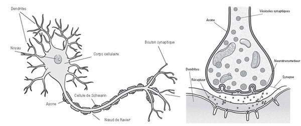
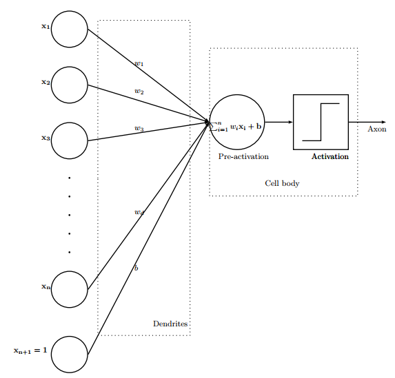

#Projet

Le projet de ce stage est de prédire si la molécule sera-t-elle apte à passer la barrière placentaire ou pas.

# Introduction

"Un réseau de neurones artificiels (réseau neuronal artificiel) est un système dont la conception est inspirée du fonctionnement des neurones biologiques, et qui par la suite s'est rapproché des méthodes statistiques." (Wikipédia).  

Les réseaux de neurones se basent initialement sur les neurones biologiques en se servant des outils mathématiques dont les probabilités.  

## Un neurone 

Un neurone biologique est composé de trois parties principales :
un corps cellulaire, un axone (lien servant à la transmission des signaux) et une synapse (enclenchement d'un potentiel d'action dans le neurone pour activer la communication au neurone suivant).  

Dans un réseau de neurones, la communication entre les neurones se fait par des signaux électriques nommées "influx nerveux". L'influx nerveux traverse le neurone reçu dans les dendrites puis le long de l'axone et termine son chemin dans la terminaison synaptique. Ce signal se traduit par des neurotransmetteurs (la quantité dépend de la fréquence du signal).  

  

## Un réseau de neurone artificiel (neuron network)

Cette méthode est un terme qui ressort de plus en plus souvent lorsqu'on parle de "deep learning". Mais c'est encore un terme assez vague.  

Le "deep learning" est la prédiction d'une sortie Y (caractéristique) via un ensemble de données Xi en entrée (descripteurs), avec un algorithme permettant de prédire une caractéristique des observations.

  

La figure 2 représente un perceptron, on a une couche de neurones (qui sont également appelés des variables d'entrées). Cette méthode peut s'appliquer à la classification binaire linéaire. Lorsqu'on fait de la prédiction, il y a toujours un risque d'erreur. De ce fait pour réduire cette erreur, on doit ajuster le perceptron (poids de connexion), c'est-à-dire affiner les résultats en augmentant le nombre de neurones.  

Un réseau de neurone plus dévelopé est composé de milliers voire de millions de neurones organisés en couches interconnectées (couches cachés) grâce à des liens pondérés (Wi). Chaque noeud est caractérisé par l’ensemble [Fi (fonction d’activation) + Ci (condition d’activation)]. Ainsi pour obtenir les meilleurs résultats de prédiction et d'estimation, on doit trouver la combinaison optimale des trois paramètres (Wi + Fi + Ci).  

Donc l'utilisation des réseaux de neurones est donc intéressant pour analyser nos données et trouver si une molécule serait-elle capable ou pas de passer la barrière placentaire.  

# Réseaux de neurones

Nous allons travailler les réseaux de neurones avec le logiciel Rmarkdown (ou RStudio). Ce logiciel est un excellent outil mathématiques notamment dans les outils de probabilités et statistiques.  

Il existe deux librairies qui permettent toutes les deux de faire des calculs d'apprentissage sur les réseaux neurones.  
Les deux librairies sont `nnet` et `neural net`. Ces deux librairies seront alors étudiées et on déterminera laquelles des deux utilisées.  

## Libraries `nnet`

La librarie `nnet` est la plus ancienne des deux librairies. Cette librairie est utiliser pour les réseaux neuronaux en aval avec une seule couche cachée (et pour les modèles log-linéaires multinomiaux). La condition d'une unique couche neuronal ressemble fortement au perceptron.  

La librairie contient une fonction `nnet` qui permet d'installer un réseau neuronal à couche unique caché. Pour le calcul de probabilités, nous pouvons utiliser la fonction `predict`.  

## Librairie `neuralnet`  

La librarie `neuralnet` permet des réglages flexibles par le biais d'un choix personnalisé d'erreurs et d'une fonction d'activation.  

La librairie possède une fonction `neuralnet` pouvant installer un réseau neuronal à un ou plusieurs couches cachés, nous sommes donc moins limités dans le nombre de couches cachés. Cependant, pour calculer les probabilités, nous devrons alors utiliser la fonction `compute`.  

# Utilisation des deux méthodes sur les données d'IRIS

Le modèle IRIS est un jeu de données qui restent assez facilement compréhensible et également facilement interprétable. Il y a peu de descripteurs (4 descripteurs : longueur et largeur des sépales et pétales), c'est un modèle de faible complexité.

Pour travailler sur la prédiction avec le modèle d'IRIS, notre descripteur à prédire est de quelle espèce est l'individu contenu dans le vecteur "Species". Il existe trois différentes espèces : SETOSA, VERSICOLOR et VIRGINICA.  

## Création de la matrice des données

Pour les deux méthodes, nous avons crée trois nouveaux vecteurs qui servent à montrer si l'individu est-il de l'espèce choisit ou pas. Par exemple pour l'espèce SETOSA, on crée un vecteur qui contient deux valeurs. Soit "1" soit "0", qui représente le fait d'être SETOSA et le fait de ne pas être SETOSA (donc VERSICOLOR/VIRGINICA) respectivement.  

### Réseaux de neurones avec `nnet`  

Les trois vecteurs crées serviront pour calculer AUC (aire sous la courbe).   

### Réseaux de neurones avec `neuralnet`  

Les trois vecteurs crées remplaceront la variable "Species" dans le jeu de données. Car la fonction `neuralnet` nécessite que la variable soit un facteur avec des valeurs binaires ("0" ou "1").  

## Prédiction

Nous avons utilisé la fonction `sample` qui permet de sélectionner des individus aléatoires dans le jeu de données. Nous créons deux data.frame qui correspond aux échantillons d'apprentissage et aux échantillons de test. Dans l'échantillon d'apprentissage, nous avons pris 2/3 des individus du jeu de données de départ. Alors que dans l'échantillon de test, nous avons les individus restants (1/3).  

Cela permet d'avoir un modèle ayant des performances non biaisées.  

### Réseaux de neurones avec `nnet`

La fonction `nnet` retourne un objet de la classe `nnet` ou `nnet.formula`. Principalement structure interne, mais avec des composants :  

  - `wts` : le meilleur ensemble de poids trouvé.  
  - `value` : valeur du critère d'ajustement plus le terme de décroissance du poids.  
  - `fitted.values` : les valeurs ajustées pour les données d'entraînement.  
  - `residuals` : les résidus pour les données de formation.  
  - `convergence` : 1 si le nombre maximum d'itérations a été atteint, sinon 0.  

Ensuite , on utilise la fonction `predict` qui prédit si l'individu est de quelle espèce (parmi les trois espèces). Puis, nous pouvons créer une matrice de fonction avec la fonction `table`. Dans la matrice, la diagonale représente toutes les individus qui sont correctement prédits, en dehors de la diagonale, la prédiction n'a pas été correct depuis les autres variables (qui aident à prédire l'individu est de quelle espèce).  

`predict.ind = predict(iris.nn, newdata = iris.app, type = "class")`  
`matrice = table(predict.ind, iris.app$Species, dnn = c("predit", "observe"))`  

### Réseaux de neurones avec `neuralnet`

La fonction `neuralnet` retourne un objet de classe nn. Un objet de la classe nn est une liste contenant au maximum les composants suivants :  

  - `call` : ce qu'on a saisit dans la fonction `neuralnet`  
  - `response` : extrait de l'argument data  
  - `covariable` : les variables extraites de l'argument data  
  - `données` : l'argument des données.  
  - `résultat net` : une liste contenant le résultat global du réseau de neurones pour chaque répétition
    - probabilité pour chaque individu d'être ou pas l'espèce)  
  - `generalized.weights` : une liste contenant les poids généralisés du réseau de neurones pour chaque répétition  
  - `result.matrix` : une matrice contenant le seuil atteint, les étapes nécessaires, l'erreur, AIC et BIC (si calculé) et les poids pour chaque répétition. Chaque colonne représente une répétition  

Avec cette fonction, nous pouvons choisir le nombre de couches cachés, ainsi nous pouvons utiliser la fonction `neuralnet` pour différents nombres de couches et voir les résultats s'ils sont meilleurs ou pas.  

Ensuite, on utilise la fonction `compute` qui permet de calculer les probabilités et nous pouvons visualiser la matrice des probabilités avec `compute.prob$net.result`.  

`compute.prob = compute(neuralnet(...), data, rep = 1)`  

Si les probabilités sont corrects, nous pouvons obtenir un tableau de confusion avec pour variable "observé" et "prédiction" dont chaque variable possède deux valeurs ("0" et "1").  

## Les critères

  1. TBP (Taux de bien prédit) : les individus bien prédits sur le total des individus  
  2. Taux d'erreur :  les individus mal prédits sur le total des individus ou `1-TBP`  
  3. Sensibilité : les individus prédits positifs sur le nombre total des individus positifs  
  4. Spécificité : les individus prédits négatifs sur le nombre total des individus négatifs  
  5. F1 score  
  6. Coefficient de corrélation de Matthiews  
  
# Courbe ROC

La courbe ROC est un outil qui catégorise des éléments en deux groupes distincts sur la base d'une ou plusieurs caractéristiques de chacun des éléments.  

Nous créons un vecteur "seuil" qui contient les différentes valeurs du seuil. Ce vecteur montrera si l'individu est-il ou pas de telle espèce par rapport ce seuil.  
Il y a également deux vecteurs qu'on crée qui contient chaque valeur de la sensibilité et de la spécificité.  

Nous allons employer une boucle `for` qui fera trois choses :  

  - un vecteur sera utilisé pour contenir tous les individus dans l'échantillon d'apprentissage avec une valeur `TRUE` ou `FALSE`. La valeur `TRUE` indique que l'individu à une probabilité supérieure que le seuil d'être l'espèce indiquée. Et la valeur `FALSE` indique que l'individu n'a pas de probabilité supérieure par rapport au seuil  
  - vecteur_sensibilité : qui calculera la sensibilité de la matrice des individus prédits et des individus observés  
  - vecteur_spécificité : qui calculera la spécificité de la matrice des individus prédits et des individus observés  
  
# Recherche des paramètres optimaux

On utilise la fonction `tune.nnet`  
La valeur de `best performance` donne le meilleur rendement atteint.

# Comparaison  

## Neuralnet  

Avantages :  

  - on peut travailler sur plusieurs couches de neurones -> résultats plus affinés  

Inconvénients :  

  - pour la fonction "neuralnet", il faut entrer tous les descripteurs  
  - pas trouver comment faire une matrice de confusion  
  - compute ne donne que les probabilités pour chaque individu s'il est ou pas l'espèce recherchée  
  
## Nnet  

Avantages :  

  - pour la fonction nnet -> il suffit de mettre un point pour indiquer tous les descripteurs  
  - "predict" détermine l'individu à quelle espèce il correspond -> ainsi pouvoir faire une matrice de confusion  

Inconvénients :  

  - on ne peut pas affiner les résultats en modifiant le nombre de couches cachées  

# Étude des données Edragon avec `neuralnet`

## Présentation des données

Le jeu de données contient 90 individus (90 lignes) et 138 variables (138 colonnes). 

ACP : permet de réduire le nombre de variables en seulement deux, trois voire quatre composantes principales en rassemblant le maximun d'informations dans chaque variable. Lorsqu'on fait un plot de l'ACP, la grande majorité des informations se trouvent dans PC1 (composante princpale 1). Ccependant les PC2 et PC3 contiennent des informations non négligeables, il est dont nécessaire des les prendre en compte.   

Après visualisation par un `biplot`, on peut difficilement distinguer les individus, il y a beaucoup de variable.

## Nettoyage des données

Le jeu de données contenaient encore des variables qui devaient être supprimées.  

On a vérifié s'il y contenait toujours des variables à variance nulle. On a utilisé les fonctions `apply(... FUN = var))` qui a permis de calculer la variance de chaque colonne et `which` qui permet de choisir que les variances nulles ou du moins des variances faibles (proche de 0) et de les enlever du jeu de données.  

Ensuite, nous avons cherché s'il y avait encore des variables corrélées. On aurait d'abord utilisé la fonction `cor`  
`mat.Cor = cor(placenta2[,-(which(colnames(placenta2)== "Noms"))])`  
`varSup = findCorrelation(mat.Cor, cutoff = 0.8)`  
`placenta2 = placenta2[,-varSup]`  

Normaliser les données  
`placenta = as.data.frame(scale(placenta[-1], center = TRUE, scale = TRUE))`  

## Analyse du jeu de données

Le facteur auquel on va travailler est la clairance. On a choisit de créer un vecteur qui serait un descripteur qualitative. Séparation des individus ayant une clairance supérieure à 0.5 et inférieure à 0.5.

# Crédits

Article sur les réseaux de neurones : https://meritis.fr/ia/deep-learning/  

Performant : le modèle présente de bonnes performances (prédit bien)
Reproductible : le modèle est applicable à d'autres jeux de données
